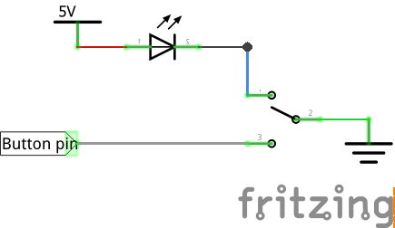
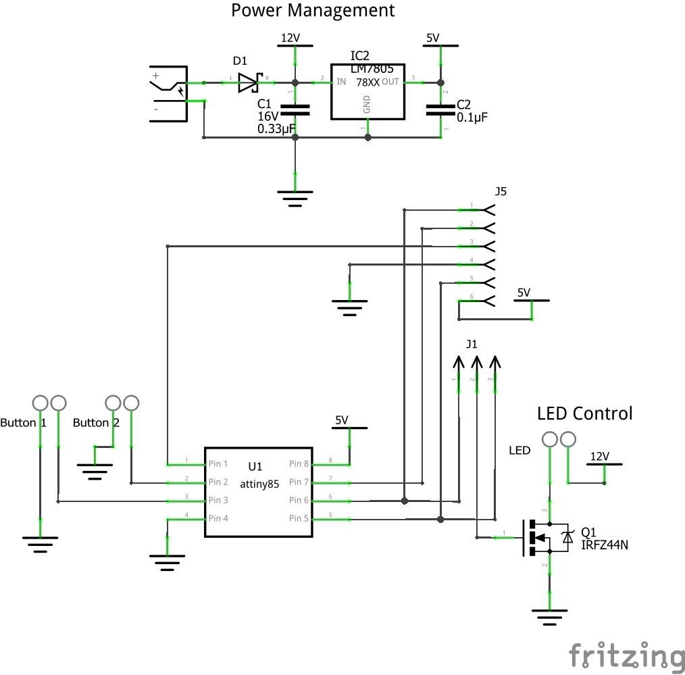
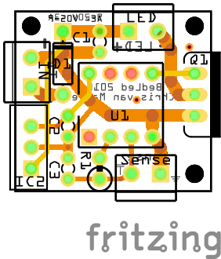

# BedLed

## Video

In this video you see the switches I've chosen. These are [5V metal momentary switches](https://www.aliexpress.com/snapshot/0.html?spm=a2g0s.9042647.0.0.nO2JPc&orderId=84821251020941&productId=32697109472) along with [a socket](https://www.aliexpress.com/snapshot/0.html?spm=a2g0s.9042647.0.0.nO2JPc&orderId=84821251030941&productId=32811846605).

These switches have 5 pins, with the following colors attached on the socket:
1. Red - LED Source (+)
2. Black - LED Ground (-)
3. White - Normally Open (NO)
4. Green - Common (C)
5. Blue - Normally Closed (NC)

When the button is released NC is connected to C and NO is not connected.
When the button is pressed NO is connected to C and NC is not connected.

I have connected + to 5V, - to NC, NO to my button pin, C to ground. So when the button is not pressed, current flows from - through NC, to C, to ground, connecting the LED - to ground.
When the button is pressed, the LED flow is interrupted and the LED turns of (signaling the user a confirmation of the pressing). The button pin on the ATtiny is then connected through NO to ground.

## Schema

Also available on [Aisler](https://aisler.net/qistoph/bedled/main-pcb)

## Parts
- D1 - Skottky diode (20V, 3A)
- C1 - 16V, 0.33µF
- C2 - 5V, 0.1µF
- IC2 - LM7805
- Q1 - IRFZ44N
- U1 - ATtiny85
- J1 - 2 pin haeder with jumper
- Power supply socket
- Terminals for button and LED connections
- Buttons

Optional:
- J2 - 2x3 pin ICSP header (optional)
- RF expansion (e.g. 433 MHz receiver)
- Reset button (with 2-pin connector)

Connector pins:
- J1, 1 - Pin 6 (PB1, MISO)
- J1, 2 - Q1 gate

J1 - Jumper options:
- 1-2: Pin 6 (PB1) connected to Q1 gate

J2 - ICSP
- 1: MISO
- 2: VCC
- 3: SCK
- 4: MOSI
- 5: RESET
- 6: GND

J3 - RF expansion
- 1: GND
- 2: NC
- 3: Data
- 4: VCC

A serial connection with status/debug info (at 9600 baud) is available on J2-3 (SCK) which is connected to U1-PB2.

The optional reset button can be connected to J2-5,6. Computer power/reset switches are very suitable for this.

## Flashing
To prevent interruptions and blinking the LED strip during flashing:
- Disconnect the MOSFET by removing the jumper on J1 (freeing pin 6 - MISO)
- Remove the RF expansion (freeing pin 5 - MOSI)

## RF (KlikAaanKlikUit)
### Learning mode
To enter the learning mode, hold one of the buttons and press reset. Then release the button. The light will blink twice.

The chip will store 5 addresses.
Pressing the "on" button will add the address, if it's not already added. The light will blink to confirm the action.
Pressing the "off" button will remove the address, if it's a known address. The light will blink to confirm the action.

The exit learning mode, press a wired button once. The light will blink once.

### Clear all addresses
To earase all learned addresses from memory. Press and hold a button, then reset and keep holding the button until the light blinks 5 times (about 5 seconds). Release the button. The regular learning mode (with an empty memory) is now initiated.
